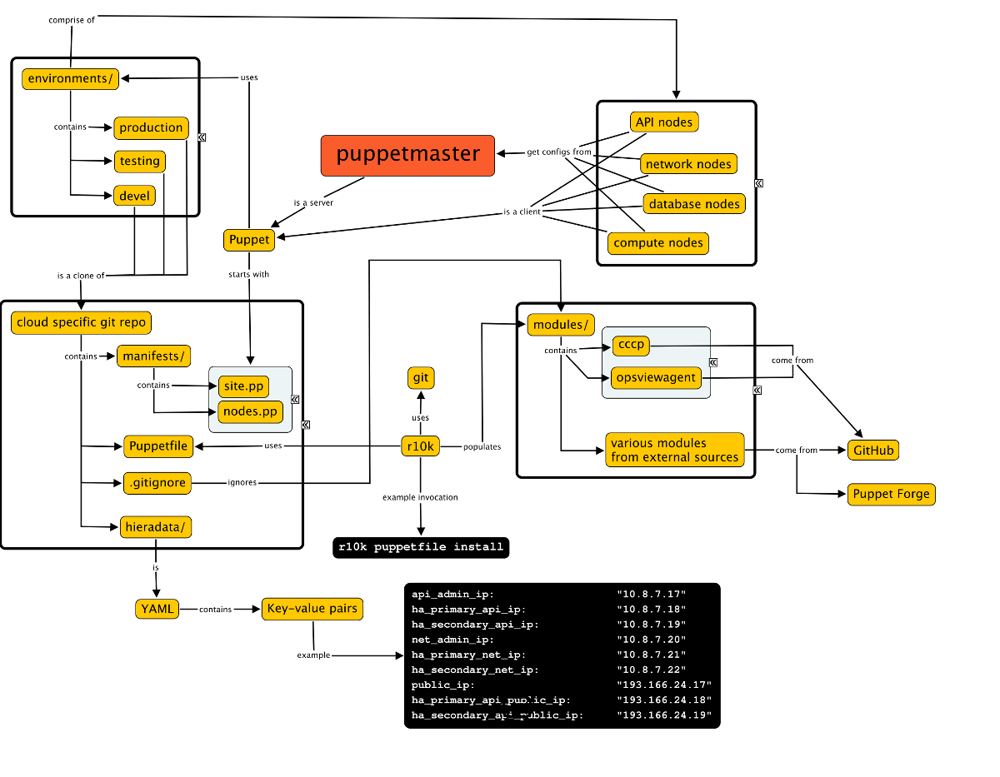

Design and implement tools for configuration management and automated building
==============================================================================

The Clouds environments at CSC are automatically build using the standard configuration
management tool Puppet. Puppet supports environments, which allows to provide environment
specific informations for environments like development, test and production. The tool
r10k is used to setup those environments automatically. The following figure shows the
architectural overview of the Puppet automated configuration management environment.

Configuration Management
------------------------

The main configuration of the Openstack nodes is run through Puppet. The puppet service
runs on the management server (Puppetmaster). Puppet gets the configuration code from a
source code repository.

Puppet installation info
------------------------

The version of Puppet in EPEL is too old. Instead of EPEL the yum repo provided by
Puppetlabs is used to install Puppet. Information for installing the correct repositories
can be found here:

   * https://docs.puppet.com/guides/puppetlabs_package_repositories.html#yum-based-systems

The Puppet installations uses Puppet environments where each environment represents a
branch in a git repository. The main development branch is called either *master* or
*test*, and the Puppet code used in production is the *production* branch. The directory
structure is at */etc/puppet/environments*, where each sub directory represents a Git
branch. The idea is that changes go from a feature branch to *master* or *test* and then
from there to the *production* branch.

Manually installing PuppetDB
----------------------------

When PuppetDB is used, the configured nodes can report their configuration information,
and this information can be collected in another place. SWIFT puppet scripts use this to
configure the frontend.

Basically these instructions were followed http://docs.puppetlabs.com/puppetdb/1.6/install_from_packages.html

   * Installed *puppetdb puppetdb-terminus*
   * In */etc/sysconfig/puppetdb* set the java heap size to 1GB
   * Added in */etc/puppet/puppetdb.conf*

.. code-block:: bash

   [main]
   server = puppetmaster.csc.fi
   port = 8081

* In */etc/puppet/puppet.conf* under *[main]*

.. code-block:: bash

    storeconfigs          = true
    storeconfigs_backend  = puppetdb

* And */etc/puppet/routes.yaml*

.. code-block:: yaml
   ---
   master:
     facts:
       terminus: puppetdb
       cache: yaml

Basic Puppet usage
------------------

For detailed information, there is a book available called Pro Puppet. Further useful
information can be found in the official documentation at http://docs.puppetlabs.com/puppet/3/reference/

Adding new hosts under control of the puppetmaster
--------------------------------------------------

Puppet uses certificates to verify host identities. The trust model is
"trust upon first use", which is the same as in SSH. New hosts are trusted the first time
and certificates are verified on additional connections.

When a Puppet agent first tries to connect to a master, it will generate a certificate and
send a request to the master to get the certificate signed. The request needs to be signed
on the puppetmaster:

.. code-block:: bash

   # On agent
   [root@c1 ~]# puppet agent -t
   # On puppetmaster
   [root@puppetmaster modules]# puppet cert sign c1.csc.fi

Existing certificates can be listed with *puppet cert list --all*:
 
.. code-block:: bash

   [root@puppetmaster ~]# puppet cert list --all
   + "c1.csc.fi"            (SHA256) 4F:20:E2:24:7D:B6:E4:59:3E:FF:3E:F8:AF:47:0B:C8:2B:7B:42:F3:5E:BF:29:B2:FA:2E:56:79:CC:16:04:36
   + "forge-network.csc.fi" (SHA1) 60:2C:73:0D:2F:00:A7:18:12:F2:60:DF:25:05:42:2F:85:01:B0:C5
   + "forge.csc.fi"         (SHA1) 94:FF:6F:65:86:F8:89:AD:72:B5:A7:28:CC:AE:44:4B:85:53:AC:0D
   + "puppetmaster.csc.fi"  (SHA1) BB:8F:53:CD:6D:9E:91:FC:0D:6E:6E:EA:BF:46:00:61:99:A3:F5:D3 (alt names: "DNS:puppet", "DNS:puppet.csc.fi", "DNS:puppetmaster.csc.fi")

If a certificate is already stored for the host (for example a reprovisioned node), the
old certificate need to be removed from the master. Here is an example:
 
.. code-block:: bash

   # On puppetmaster
   [root@puppetmaster modules]# puppet cert clean c1.csc.fi
   [root@puppetmaster modules]# service puppetmaster restart
   
   # On agent
   [root@c1 ~]# rm -f /var/lib/puppet/ssl/certs/c1.csc.fi.pem
   [root@c1 ~]# puppet agent -t
   
   # On puppetmaster again
   [root@puppetmaster modules]# puppet cert list
     "c1.csc.fi" (SHA256) 11:DC:FA:CD:B5:4E:D5:5B:23:FA:B1:3B:95:15:FB:83:3B:0D:2F:E6:D4:AA:25:7B:B6:A6:A4:EC:EB:D8:B9:08
   [root@puppetmaster modules]# puppet cert sign c1.csc.fi

Agents can then be updated like so:

.. code-block:: bash

   [root@forge-cloud1 ~]# pdsh -f 2 -w c[2-16] puppet agent -t

This command will only execute on two nodes at a time, preventing the puppetmaster from
overload.

Module management
-----------------

All Puppet modules are installed in an environment. There are no Puppet modules under the
default location */etc/puppet/modules*. This needs to be taken into account when
installing new modules.

As the Puppet module tool can only install modules from the Puppet Forge or a server that
implements the same API, r10k is used to install third party modules. This is because some
modules need to be installed from Github so that a recent enough version can be used. r10k
can install modules from both the Puppet Forge and any given Git repository.

Third party modules that need to be modified need to be installed from Github by first
forking the module project in Github and then pointing r10k to the fork. There is an
organisation in Github that has been setup for this: https://github.com/organizations/CSC-IT-Center-for-Science
All forked modules can be found there.

r10k usage
----------

r10k is used on the Puppetmaster to fetch third party modules from Github and Puppet Forge
and to dynamically create Puppet environments based on the branches of a so called control
repository. It creates environments at */etc/puppet/environments* and populates the
*modules/* directory for each environment based on a file called *Puppetfile* in each
environment. Here is an example Puppetfile that covers all the important cases:

.. code-block:: ruby

   # Where r10k can find a Puppet Forge server
   forge "http://forge.puppetlabs.com"
   
   # Install the latest version of a module from the Puppet Forge
   mod "camptocamp/kmod"
   # Install a specific version of a module from the Puppet Forge
   mod "puppetlabs/mysql", "0.9.0"
   
   # Install the latest version of a module from the master branch of a Git repo
   mod "ldap",
     :git => "git://github.com/CSC-IT-Center-for-Science/puppet-ldap.git"
   
   # Install a specific ref from a Git repo
   mod "cinder",
     :git => "git://github.com/stackforge/puppet-cinder.git"
     :ref => 'stable/liberty'

Installing r10k:

.. code-block:: bash

   gem install r10k

Using r10k to dynamically create environments (only cPouta for now):
 
.. code-block:: bash

   r10k deploy environment -c /etc/puppet/r10k.yaml -p -v error

Using r10k to populate a modules directory with modules defined in a Puppetfile:

.. code-block:: bash

   r10k puppetfile install
 
Forks of openstack Puppet modules
---------------------------------

Most of the modules used are forked from the Openstack Puppet modules. The current list of
forked modules can be found here: https://github.com/CSC-IT-Center-for-Science/
To fork a module, go to https://github.com/openstack/, and select fork in the upper right
corner.

Testing changes
---------------

There are some useful commands for testing puppet manifests before applying them globally.
These are (in the order they should be run):

Syntax validation:

.. code-block:: bash

   puppet parser validate mycustommodule.pp

Configuration test on the agent side without actually doing anything (the noop flag):

.. code-block:: bash

   puppet agent --test --noop

Apply configuration on the agent, give useful feedback and exit:

.. code-block:: bash

   puppet agent --test

If there are bigger problems, --debug can be used (the output is very verbose):

.. code-block:: bash

   puppet agent --test --debug

Puppet server can also be run manually in foreground mode to debug problems on the
puppetmaster:

.. code-block:: bash

   puppet master --no-daemonize --debug -v -l console

Pitfalls
--------

   * Some older versions of Puppet do not support plugins properly unless the modules are
     installed on the agents as well as the puppetmaster. This will cause manifests to
     fail in a hard to debug way, since the plugins just do not run on the agents.
     The easiest way is to just use the yum repo from Puppetlabs to install Puppet.
   * Class ordering is important in some cases, and can be especially difficult when
     building own modules from complex third party submodules. If there is a ready
     made composite module available that uses the submodules, it should be used.
   * "Could not match" error for no obvious reason when running Puppet. There might be
     some hidden characters in the manifest file. Unicode non-breaking spaces (c2 a0) will
     break the Puppet parser. Those can be detected with hexdump or ":set list" in vim
     with the correct listchars set. See: http://projects.puppetlabs.com/issues/10291

Serious issues with environments and pluginsync (Invalid parameter provider on...)
----------------------------------------------------------------------------------

See: https://tickets.puppetlabs.com/browse/PUP-1515

When using environments and plugins, there are issues when Puppet agents use plugins.
Puppet will check for the availability of the plugins on the master where they are not
needed and don't run instead of the agent when running Puppet on the agent. This causes
Puppet runs to fail, even though the correct plugins are in place on the agent.

To fix this for a given environment, the following command can be run on the Puppetmaster:

.. code-block:: bash

  puppet plugin download --environment <agent's environment>
  service puppetmaster restart

Puppet and Openstack
---------------------

The Openstack Puppet modules consist of several modules to manage the various components
of Openstack (Neutron, Nova, Cinder etc.). There is also a composite module called
*openstack* that can manage all of Openstack, but this is rather limited and inflexible,
so CSC uses its own composite module from the basic modules for the various Openstack
components, which can be found here: https://github.com/CSC-IT-Center-for-Science/cccp

Introduction to Hiera data
--------------------------

Hiera is a tool that can be used to separate Puppet configuration management code from
configuration data. Configuration management code determines things like "this type of
server should have this package installed", while configuration data is things like
"this specific server should have this specific IP address". Separating these two makes it
possible to build several environments using the same configuration management code while
only changing the parameters that are given to that code.

Hiera supports multiple backends. The simplest backend is based on YAML files that contain
key-value pairs. The value for a key can be retrieved by using a special "hiera" function
in Puppet or through an automatic process where the value of the key is looked by Puppet
in Hiera. For more information about Hiera, see http://docs.puppetlabs.com/hiera/1/.

Hiera data storage file structure
---------------------------------

This is the layout of the Hiera data files. The files are stored in the Puppet
configuration directory under *hieradata* directory:
 
.. code-block:: bash

   /etc/puppet/hieradata/
   |-- common.yaml
   |-- devel.yaml
   |-- production.yaml
   |-- secret
   |   |-- common.eyaml
   |   |-- devel.eyaml
   |   |-- production.eyaml
   |   .-- test.eyaml
   |-- test.yaml
   `-- users.yaml

Each file stores either *common* or *environment specific* data. *common.yaml* stores all
configuration variables that are common to all environments. Informations like port
numbers, common NTP servers etc. are saved here. *devel*, *test*, and *production* contain
items like IP addresses and hostnames for individual hosts in an environment.

Separately from these there is a file called *users.yaml* which can be used to manage
users. This is common to all environments within a system, so the user accounts get
created on a per-system basis and not on a per-environment basis. This file contains
information for setting up shell user accounts for admins and has nothing to do with
Openstack user account management.

Finally there is a directory called *secret* for storing secret information like
passwords, private keys in encrypted form (*eyaml* means encrypted YAML). For more
information about modifying this data, see the chapter about storing secrets.
 
Making changes to Hiera configuration parameters
------------------------------------------------

The normal development process is to go in stages through devel, test and finally to
production:

   a) Make changes in devel branch, try it out in devel environment
   b) If all is well, merge devel branch to master branch and run Puppet again in test
   c) If all is well, merge master branch to production branch and deploy to production

Here is a useful tip for validating YAML files without running Puppet:
 
.. code-block:: bash

   ruby -e "require 'yaml'; YAML.load_file('common.yaml')"

Querying Hiera parameters
-------------------------

Hiera data can be queried directly instead of through Puppet runs. This can be useful for
troubleshooting and other purposes. The *hiera* tool on the Puppet master can be used for
that purpose.

Here are some examples:
 
.. code-block:: bash

   hiera variable_name --config /etc/puppet/hiera.yaml ::environment=test test1.epouta.csc.fi
   hiera variable_name --config /etc/puppet/hiera.yaml ::environment=devel devel1.epouta.csc.fi
   hiera secret_variable_name --config /etc/puppet/hiera.yaml ::environment=test
   <password would be shown here>

Both secret and non-secret data can be queried.

Hiera configuration
-------------------

The location used by Puppet for Hiera configuration is */etc/puppet/hiera.yaml*. This file
tells Hiera which backends are available, any configuration options for the backends and
where to find the actual Hiera data. Here is an example with different configuration
options:

.. code-block:: yaml

   ---
   :backends:
     - yaml
     - eyaml
   
   :hierarchy:
     - secret/%{::environment}
     - secret/common
     - "%{::environment}"
     - users
     - common
   
   :yaml:
     :datadir: '/etc/puppet/environments/%{::environment}/hieradata'
   :eyaml:
     :datadir: '/etc/puppet/environments/%{::environment}/hieradata'
     :pkcs7_private_key: '/etc/puppet/keys/private_key.pkcs7.pem'
     :pkcs7_public_key: '/etc/puppet/keys/public_key.pkcs7.pem'</verbatim>

There are four sections in the file above.

1. **backends**
   The first one defines the backends available for Hiera. The first is the basic yaml
   backend that is based on yaml files. The second is eyaml which is also based on yaml
   files, but can also do decryption of encrypted values within yaml files.

2. **hierarchy**
   The second section tells Hiera in which order to check files for resolving the value of
   a given key. The hierarchy above would be resolved as following:

   a) Search in secret/%{environment} for the value where %{environment} resolves to the
      Puppet environment currently used
   b) If not found, search in secret/common for the value
   c) If not found, search in %{environment}
   d) If not found, search in users
   e) If not found, search in common

3. **yaml**
   The third section configures the basic yaml backend. The only configuration option is
   "datadir", which tells Hiera where to find the yaml files that contain configuration.
   In this example, the datadir is per environment.

4. **eyaml**
   The fourth section configures the eyaml backend and is much the same as the yaml
   section but in addition also configures locations for the public and private keys used
   by eyaml.

Managing admin user accounts
----------------------------

To illustrate the content of a hieradata file, the following example shows user
informations in *users.yaml*:

.. code-block:: bash

   sudoers:
     some_users_name:
       content: "some_users_name ALL=(ALL) NOPASSWD: ALL\n"
   
   users:
     some_users_name:
       ensure: "present"
       comment: "Some User"
       managehome: "true"
       uid: "911"
   
   ssh_authorized_keys:
     some_users_name:
       ensure: "present"
       key: "AAAAB3Nza...<->...wQ=="
       type: "ssh-rsa"
       user: "some_users_name"

The sudoers entry will add a configuration file at /etc/sudoers.d/ which gives
*some_users_name* sudo root access without password. The users entry will add a user
called *some_users_name* with uid 911 to the system. The ssh_authorized_keys entry will
provide a public key in the user's home directory.

Storing secrets with eyaml
--------------------------

Hiera supports multiple backends. One of these backends is *hiera-eyaml* that will read
encrypted entries from eyaml files, decrypt them and pass them on to the client host.

Installing and configuring eyaml (client configuration)
-------------------------------------------------------

Up to date instructions for installing hiera-eyaml can be found here: https://github.com/TomPoulton/hiera-eyaml

Hiera-eyaml is written in Ruby, therefore ruby gem is used to install it:
 
.. code-block:: bash

   gem install hiera-eyaml

In addition to the executable, the public key need to be placed in the home directory
inside .eyaml/ directory:

.. code-block:: bash

   cd $HOME
   ls .eyaml/
   public_key_epouta.pkcs7.pem

Installing and configuring eyaml (server configuration)
-------------------------------------------------------

Just as with the client instructions, the most up to date information can be found
here: https://github.com/TomPoulton/hiera-eyaml

The installation on the server side is much the same, but here also keypair for encryption
and decryption need to be created.

.. code-block:: bash

   cd /etc/puppet
   eyaml createkeys

This will create a new directory in current working directory called "keys" which will
contain a public and a private key. A good place for this key directory is
"/etc/puppet/keys". Both keys should be read-only and the private key should be only
readable by the puppet user:
 
.. code-block:: bash

   chown puppet:puppet /etc/puppet/keys/*
   chmod o-rwx /etc/puppet/keys
   chmod og-rwx /etc/puppet/keys/private_key.pkcs7.pem
   chmod ugo-wx /etc/puppet/keys/public_key.pkcs7.pem
   ls -ahl keys/
   total 16K
   drwxr-x---. 2 puppet puppet 4,0K Aug 28 14:26 .
   drwxr-xr-x. 7 root   root   4,0K Aug 31 12:46 ..
   -r--------. 1 puppet puppet 1,7K Aug 28 14:26 private_key.pkcs7.pem
   -r--r--r--. 1 puppet puppet 1,1K Aug 28 14:26 public_key.pkcs7.pem

Modifying secret data
---------------------

For encryption of hieradata, the public key need to be installed in the users home
directory inside .eyaml/. The private key is not necessary for encryption of data.

.. code-block:: bash

   eyaml encrypt --pkcs7-public-key=~/.eyaml/public_key.pkcs7.pem -p -l 'big_secret'
   Enter password: 

The eyaml tool will print a YAML block which need to be copied into the eyaml file. Here
is an example secret encrypted with eyaml and placed in a file that can be in version
control:

.. code-block:: bash

   big_secret: >
       ENC[PKCS7,MIIBiQYJKoZIhvcNAQcDoIIBejCCAXYCAQAxggEhMIIBHQIBADAFMAACAQEw
       DQYJKoZIhvcNAQEBBQAEggEASkNUxTIdycmriWAd9V6q4Br1bckcjppxn9Wd
       /Zc/x7JbU5vDe5bbeDEdFhBNwzLqWAEhwhWY+snp02qOcWjIeZvepiWdrME7
       W+qiqlsUT3xDFUeo0OlymVAt8nfpKZ/+bO90hcSp89dvoZzoEgcfyOdrwWn6
       E2poIs16JFV78f9Zq0Zye7QWSzZUFxdNWR5EKJl+IO5DrwiyARN5uYXFR01n
       EMNcKEM/mCjlHUqyaAwejXzNtbjCjHIO9iedQjIGeYCrQJPaP9/QpXzwTgni
       X7ZOXZ3pFI2TnYUrDIYfKgGmNdatjQNbO9+PuFOs2EXT+oWTOD9ut3YvEiKf
       11wTzTBMBgkqhkiG9w0BBwEwHQYJYIZIAWUDBAEqBBB8gqlmUi/n3qYcK9Rl
       BOuTgCC7mq4kk1l/vvncOwHnjDlqjJJUiF42soo8tG1ZOR1wXw==]

Accessing the decrypted form of data
------------------------------------

The encrypted data can be decrypted in two ways, using the hiera tool on the puppetmaster
and by using the eyaml tool again, this time for decryption.

.. code-block:: bash

   hiera secret_variable_name --config /etc/puppet/hiera.yaml ::environment=test
 
.. code-block:: bash

   cd /etc/puppet
   eyaml decrypt -e environments/devel/hieradata/secret/common.eyaml
