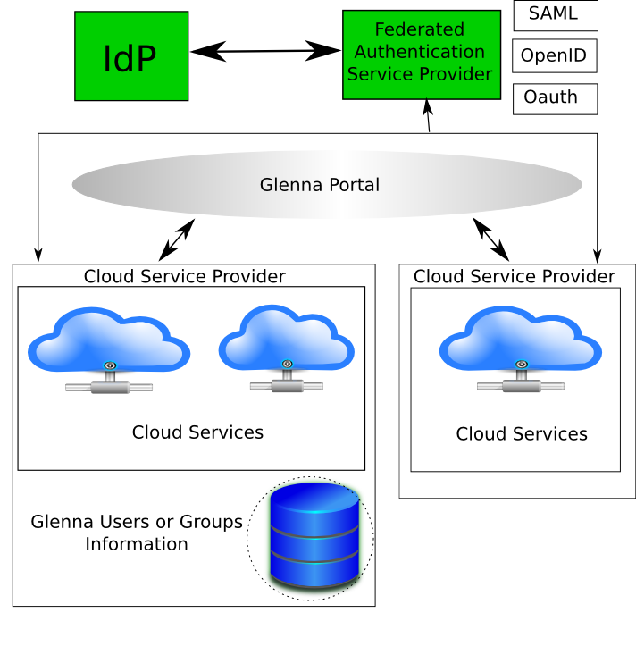
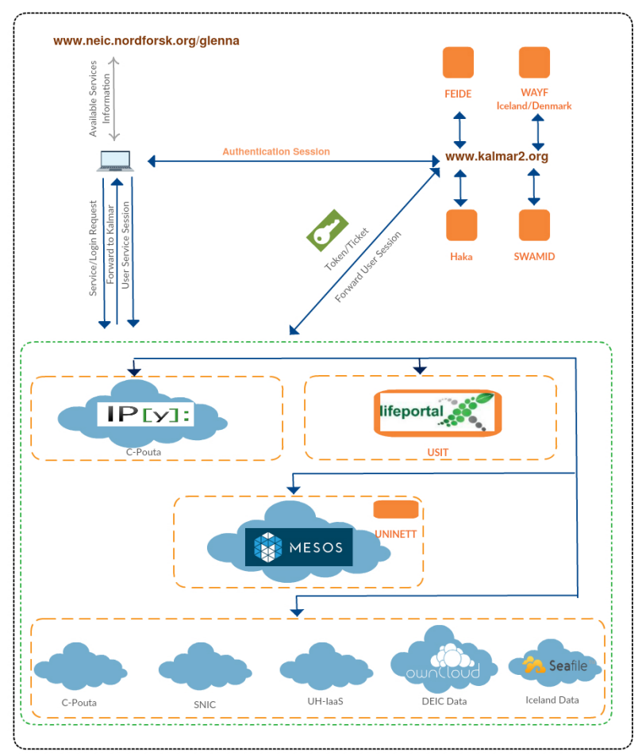
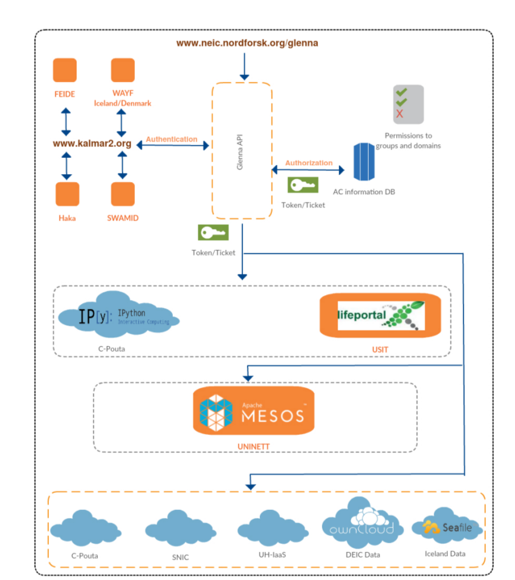

Security architecture and specification
=======================================

Develop the specification and architecture of the security components in Glenna.

The Openstack foundation has identified the following core points as the main reasons why we need federated identity in cloud services and the challenges associated with them [http://docs.openstack.org/security-guide/identity/federated-keystone.html]: -

*	Provisioning new identities often incurs some security risk. It is difficult to secure credential storage and to deploy it with proper policies. A common identity store is useful as it can be set up properly once and used in multiple places. With Federated Identity, there is no longer a need to provision user entries in Identity service, since the user entries already exist in the IdP’s databases.
*	This does introduce new challenges around protecting that identity. However, this is a worthwhile tradeoff given the greater control, and fewer credential databases that come with a centralized common identity store.
*	It is a burden on the clients to deal with multiple tokens across multiple cloud service providers. Federated Identity provides single sign on to the user, who can use the credentials provided and maintained by the user’s IdP to access many different services on the Internet.
*	Users spend too much time logging in or going through ‘Forget Password’ workflows. Federated identity allows for single sign on, which is easier and faster for users and requires fewer password resets. The IdPs manage user identities and passwords so OpenStack does not have to.
*	Too much time is spent administering identities in various service providers.
*	The best test of interoperability in the cloud is the ability to enable a user with one set of credentials in an IdP to access multiple cloud services. Organizations, each using its own IdP can easily allow their users to collaborate and quickly share the same cloud services.
*	Removes a blocker to cloud brokering and multi-cloud workload management. There is no need to build additional authentication mechanisms to authenticate users, since the IdPs take care of authenticating their own users using whichever technologies they deem to be appropriate. In most organizations, multiple authentication technologies are already in use.

Security overview in Federated Cloud Infrastructure 
***************************************************

Security in any IT system entails the Confidentiality, Integrity and Availability of the system as a whole and its individual components (data and infrastructure). Confidentiality ensures that information is accessible only to authorized people and if unauthorized entitles get access to data, they shouldn´t get any valuable information out of it. With integrity a system shall block un-authorized modification of data. The third pillar deals with making systems available for users. So that the system functions properly in which ever circumstance. These basic three pillars still apply to Cloud Computing Systems and the change is in how one can keep the Confidentiality, Integrity and Availability of systems.

Unlike the traditional computing environments, cloud computing has brought its own specialties for the good of systems running on it. For instance the resource sharing, scalability, on-demand resource pooling and the likes are interesting characteristics in cloud computing.  When it comes to security however each characteristics brings new challenges in the way one can keep the CIA of cloud computing environments.

In the context of Glenna, the challenges in implementing security services like authentication and authorization are eased because of the federated authentication scheme. In such environments, the requirements to keep the confidentiality and integrity of data are more or less handled by existing authentication and authorization systems. The Kalmar2 and EduGAIN federated authentication systems have both been used in various systems within the academic and research environments and well tested. The 4 national level Identity Providers (IdPs) namely FEIDE, SWAM-ID, HAKA and WAYF are also currently being used in the 5 Nordic counties and in continuous development to deal with associated security risks. It will then be a matter of identifying in what way Glenna can use this existing systems rather than dealing with the security aspect. But when it comes to individual cloud service providers involved in the Federation, a due consideration of the security aspects of the respective systems and infrastructures is needed.

As the individual cloud service providers also use own local authentication and authorization mechanisms, a security analysis to identify the strength and weaknesses of local systems will be very helpful. A chain is as strong as its weakest link and a security problem in any of the services can induce a general security problem to the entire federation. 

Apart from keeping the confidentiality and integrity of systems and data, availability shall also be given due emphasis. Currently Business Continuity, Disaster Recovery and Resilience are becoming important characteristics of IT services including the cloud and we suggest some approaches to attain such characteristics in the services involved in Glenna Federation. 

Based on what we have experienced so far there are systems and solutions in the Nordics that can aid the security of the Glenna Federation and we try to come up with security solutions that can be added on top of the existing ones and makes the entire system more secure.  In the next section we go through the suggested security architecture and security components specifications for Glenna.

Security Architecture and Specification for Glenna  
**************************************************

The three Cloud Service Models (IaaS, PaaS and SaaS) have different levels of extensibility and security responsibility for the cloud service provider. According to the CSA description - 

* IaaS: More extensibility and less security responsibility to the provider
* SaaS: Less extensibility and high security responsibility to the provider
* PaaS: in between the two service models in both extensibility and security responsibility.

Before going to the details of security in these three service models we first describe what the service models entail in cloud computing. NIST defines IaaS as “The capability provided to the consumer to provision processing, storage, networks and other fundamental computing resources where the consumer is able to deploy and run arbitrary software which can include operating systems and applications. The consumer does not manage or control the underlying cloud infrastructure but has control over operating systems, storage, deployed applications and possibly limited control of select networking components (e.g. host firewalls)”.  In this service model the security responsibility is divided between the service provider and the customer, which makes it difficult to identify a clear demarcation. Added to that, security breaches can also be highly damaging as the customers have access to the infrastructure.

The spectrum of IaaS vendors is very wide, in which some offer large full data-center-style infrastructure replication while others offer more end-user-centric services, such as simple data storage (e.g. Amazon Simple Storage Service S3 or Dropbox) [ ]. Currently the services we are considering in Glenna mainly go to these category as the three countries Norway, Sweden and Finland are focusing on IaaS and the other two Denmark and Iceland focus on Storage service which is also considered as IaaS as per the definition above.

In SaaS it’s possible to implement a Pay per use or free for use licensing model in which the customer is subscribed to a complete cloud hardware, software and maintenance package. In this service model it´s not hard to realize the limited access customers have to the underlying infrastructure, which puts the main security responsibility on the service provider. 

PaaS is similar to SaaS, but the service is an entire application development environment, not just the use of an application. PaaS solutions differ from SaaS solutions in that they provide a cloud-hosted virtual development platform, accessible via a Web browser [http://www.ijcta.com/documents/volumes/vol3issue1/ijcta2012030164.pdf]. NIST describes PaaS as - “The capability provided to the consumer is to deploy onto the cloud infrastructure consumer-created or acquired applications created using programming languages and tools supported by the provider. The customer does not manage or control the underlying cloud infrastructure including network, servers, operating systems, or storage,  but has control over the deployed applications and possibly application hosting environment configurations.” The main target customers of PaaS delivery are developers and some example services include Google App Engine and Sales Force PaaS service at force.com.

As mentioned in the beginning of this section for each service delivery model the security responsibility level of customers and service providers varies.  But in any of the models the service providers have responsibility and in this document we give due emphasis to recommend security solutions and approaches to the service providers involved in Glenna. In addition to the usual cloud service delivery model, the federation induces its challenge in security. To mitigate with such challenges, we first suggest security architecture for Glenna that mainly covers how federation can be implemented in a secure manner. Then the subsequent chapters will cover other important security aspects in the cloud.

The way the federation works, differs based on the way resource authorization is decided. For instance if all authenticated users can gain access to available cloud resources with no limitation every individual can be considered autonomously and authentication through Kalmar2 or eduGAIN would suffice. In such scenario, as the individual users are autonomously authenticated and authorized to cloud resources, the users may be billed directly or the institute they are affiliated to can be billed. In this scenario, we can only identify to which institute the user belongs to based on the user account. There is no other group or project information that can be taken into consideration for billing. 

The second scenario involves consideration of users’ affiliation to groups or projects. In such cases, authorization decision to resources takes the group membership of users into consideration and there can also be resource limitation depending on the resource level the groups or projects are subscribed to. The billing in this scenario shall be directly attached to individual users or the groups/projects they belong to.

We suggested the following security architecture for the Glenna project considering the security issues discussed in this section and showing how the project shall handle its resources in a secure manner. 

As we have already discussed above, authorization to users can be given solely based on the institute extracted in thier user account or based on groups or projects formed by indiviudals from on or more institutes. In the first case authentication is the major security task and can be handled through the federated authentication mechnism in place. In the second case, authorization of resources and billing to resource utilization shall take into consideration the groups and projects of users. The Glenna security architecture can be implemented in two ways with respect to tracking information about users (in addition to users' main affiliation).

**Case I:** Each cloud service provider shall implement a mechanism to create datastore and keep track of users, groups and/or projects information, along with its cloud service delivery mechanism. The following figure shows how one can implement this option.

**Case II:** Glenna can have a resource to store such information and maintain data about users belonging to groups and projects and resources that memebers of the projects and groups are authorized to access from the cloud service providers within Glenna. The following figure shows how one can implement this option.
      

